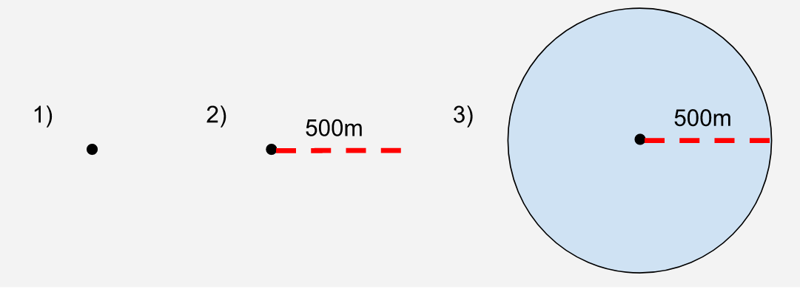

## Calculation process

## Process diagram   

### Main method of calculation

The key step of calculation is a spatial join between geolocated urban population data and public transport service areas. A discussion of how each component of that join was calculated from their component parts follows. 

### Geocoding the population data

The questions we are trying to answer in this analysis is “What proportion of people in the UK have access to public transport access points from their home?”. And then the same question for people in each age, sex and disability category. 

To make the calculation as accurate as possible, we sourced the most granularly geolocated population data possible. Ideally, this would have been right down to the individual place of living (house/flat etc.) but such granularity is not available publicly, as it would be disclosive of individuals’ living situations. The most granular level published that we are currently aware of is the “output area” (OA) data, which derives from the census. 

Output areas (more fully defined and discussed in the data section of this methodology write up) are a conglomerate of the postcodes. Those postcodes are joined together on the basis that they are:

1. Adjacent
2. Of the same urban/rural classification

In order to calculate the distance from the place any person lives, to a public transport access node (station or stop) we need a point-geometry for their residence. As we cannot geolocate individual residencies, we used an approximation in the form of population weighted centroids (PWCs). 

PWCs are a population-weighted location (x,y point) at which is a geospatial mean of the locations of all residences in that output area. The PWC, while extremely helpful in giving us a geospatial point to define where the population of any output area lives, is an approximation and is only used due to limitations in our data. 

#### Joining the data

Population weighted centroid (PWC) data is geolocated with x,y coordinates and has a common data column with the output area data (output area code, “OA11CD”) so a table join can be performed on those datasets. Then the entire population of any output area is approximated to live at the centroid.

#### Limitations and improvements

Our team recognises that PWCs do not accurately represent the location of any individual’s place of residence and we intend to  research methods of making calculations at even more granular levels, such as postcodes or smaller. Currently however we agreed with the our data end user and the geospatial department that the method to be used for version 1.0 will use the described approximation to geolocate the population.

Delimitation of urban areas

As Target 11 is concerned with sustainable urban environments, we ultimately had to select only urban areas and exclude rural areas from our analysis. Urban areas are defined as Ordnance Survey mapping that have resident populations above 10,000 people (2011 Census) and the methodology is available [here](https://www.ons.gov.uk/file?uri=/methodology/geography/geographicalproducts/ruralurbanclassifications/2011ruralurbanclassification/ruralurbanclassification2011userguide.zip). The urban/rural lookup data was sourced from [ONS’s Geography Portal ](https://geoportal.statistics.gov.uk/)and it provides a classification of each output area as either urban or rural categories which are further subdivided as follows. 

<table>
  <tr>
   <td>Classification
   </td>
   <td>Description
   </td>
   <td>Code
   </td>
  </tr>
  <tr>
   <td>Urban
   </td>
   <td>Major Conurbation
   </td>
   <td>A1
   </td>
  </tr>
  <tr>
   <td>Urban
   </td>
   <td>Minor Conurbation
   </td>
   <td>B1
   </td>
  </tr>
  <tr>
   <td>Urban
   </td>
   <td>City and Town
   </td>
   <td>C1
   </td>
  </tr>
  <tr>
   <td>Urban
   </td>
   <td>City and Town in a Sparse Setting
   </td>
   <td>C2
   </td>
  </tr>
  <tr>
   <td>Rural
   </td>
   <td>Town and Fringe
   </td>
   <td>D1
   </td>
  </tr>
  <tr>
   <td>Rural
   </td>
   <td>Town and Fringe in a Sparse Setting
   </td>
   <td>D2
   </td>
  </tr>
  <tr>
   <td>Rural
   </td>
   <td>Village
   </td>
   <td>E1
   </td>
  </tr>
  <tr>
   <td>Rural
   </td>
   <td>Village in a Sparse Setting
   </td>
   <td>E2
   </td>
  </tr>
  <tr>
   <td>Rural
   </td>
   <td>Hamlets and Isolated Dwellings
   </td>
   <td>F1
   </td>
  </tr>
  <tr>
   <td>Rural
   </td>
   <td>Hamlets and Isolated Dwellings in a Sparse Setting 
   </td>
   <td>F2
   </td>
  </tr>
</table>

In our calculation we group A1, B1, C1 and C2 as urban and any other code as rural. 

#### Joining the data

The population table for the whole nation was joined onto the table with the urban/rural classification for each output area on the output area code “OA11CD”, hence bringing in the classification into the population data. Every OA and associated PWC is therefore categorised as either urban or rural. Later we use this classification to filter the data, and disaggregate our analysis. For the SDG analysis we remove the OAs classified as rural from our analysis, but we can choose to include them to expose transport availability in rural areas too. 

### Computation of service areas

As described in the methodology of the UN Metadata for this indicator, public transport service areas had to be calculated.  Two methods to calculate service areas are described in the methodology:

1) using a Euclidean buffer to create polygon, and 

2) to create a network/path calculation. 

Our team opted for the Euclidean buffer method for a number of reasons:

* We followed advice from the ONS Geospatial department that the simpler buffering method would be adequate for our needs
* Computationally Euclidean is would be much less resource intensive and does not require distributed compute power, whereas a network calculation would require scaled compute power.
* Other countries (such as [Estonia](https://www.efgs.info/11-2-1-estonia/), [Norway](https://www.efgs.info/11-2-1-norway-test-page/) and others) used the Euclidean buffer method and published their results. Our results will be more comparable with theirs
* Research shows that the network enquiry requires a complete path network, (as pointed out by [Sweden](https://www.efgs.info/11-2-1-sweden/) in their write up, see section “**Result from the network distance calculations”**)

#### Euclidean buffering methodology

We use Geopandas and for all geospatial operations in our analysis and the buffering operation is actually carried out by the Shapely `object.buffer()` function. This operation takes a geospatial point, and uses a radius of a given length to creates a polygon around the point which approximates a circle. The standard buffering of a point yields a polygon with 99.8% of the area of the circular disk it approximates.

[

**Figure 1: Illustration of the process of buffering a geospatial Point**

The resulting geospatial polygons are then joined and can be used for further calculations. 

**Figure 2: Process of combining polygons to create the service area**

#### Notes on the network query method

A network query would be calculated by taking paths of a specified length (500m or 1km) in every direction from a specified point; for this project that point would be a transport stop or station. Following these paths for the specified distance would create many end points. Finally end points are joined to create a perimeter, within which lies the service area.

[

**Figure 3: An example visualisation of a network distance calculation, taken from the Swedish methodology write up at [https://www.efgs.info/11-2-1-sweden/](https://www.efgs.info/11-2-1-sweden/).** The image shows the stops in blue, surrounded by the Euclidean buffer, shaded in green and a 500m limit shown. 

### Calculation of population within service areas

With the service areas calculated, the population that resides within a service area is calculated by a two stage process:

1. A points in polygons enquiry which then filters the PWCs, so that the data set contains only those which are within the service areas,
2. The population figure (number of individuals) associated with each PWC is summed, meaning that only the population within the service areas is counted as the population outside of the service areas was filtered out at stage 1.
3. The proportion of the population inside a service area is calculated as a proportion of the total population. Currently for version 1.0, this is carried out at Local Authority (LA) level.

### Disaggregations

As required for the SDG indicator we are producing this data for, the output data from this project has been disaggregated by sex, age and disability status. 
